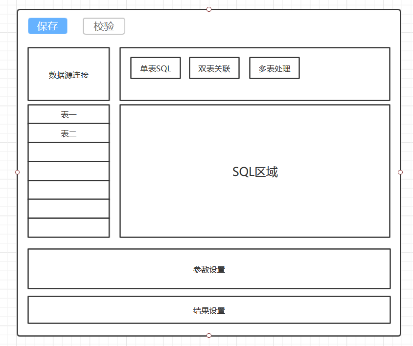
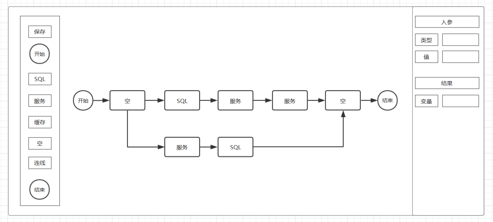

MEB（Micro Enterprise Basic）Platform 数据引擎
========

MEB Data Engine，数据引擎，Web在线化数据流解决方案，解决业务场景数据获取处理的繁杂性问题，抽象数据服务，支撑表单引擎、规则引擎等（集群开发项目）数据获取场景，也可独立部署嵌套于任意业务应用。

功能模块
--------------------

* SQL面板

    * 可视化SQL生成器，单表、级联自动生成，SQL校验，简化SQL编写
    * 多数据源形式支持，涵盖大部分应用场景，做到数据流引擎的跨场景应用
    
* 服务面板

    * 定制数据获取服务接口，可视化配置器，支持REST等多形式接口
    * Netty框架支撑，保证服务处理的性能、稳定性

* 中间件面板

    * 获取缓存、消息、ES等中间件数据
    * 支持Redis、EhCache等缓存中间件
    * 支持RabbitMQ、Kafka等消息中间件、
    * 支持ElasticSearch等检索引擎
  
* 数据流引擎

    * 定制简化版流程引擎，支持数据端到端流程化处理
    * 支持多形式数据项集成
    * 支持串并行数据项耦合

* 执行引擎

    * 开放数据流引擎RPC接口
    * 多场景数据流逻辑处理
    
* 监控运维

    * 集成JVM性能监控等工具
    * Docker自动化部署等工具

概念设计
--------------------

* SQL面板

  

* 数据流引擎面板

  