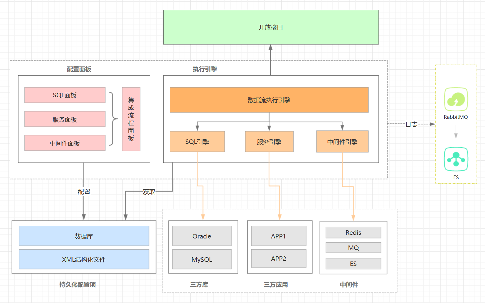

MEB（Micro Enterprise Basic）Platform 数据引擎
========

Sky Data Flow Engine，数据流引擎，Web可视化数据流中间件，解决开发场景后台逻辑服务集成编排的繁杂性问题，抽象逻辑数据处理，变革传统开发流程，提升产品代码开发速度。

功能模块
--------------------
    
* 逻辑组件

    * 后台代码逻辑方法调用
    
* 服务组件

    * 定制数据获取服务接口，可视化配置器，支持REST等多形式接口
    * Netty框架支撑，保证服务处理的性能、稳定性
    
* SQL组件

    * 可视化SQL生成器，单表、级联自动生成，SQL校验，简化SQL编写
    * 多数据源形式支持，涵盖大部分应用场景，做到数据流引擎的跨场景应用

* 中间件组件

    * 获取缓存、消息、ES等中间件数据
    * 支持Redis、EhCache等缓存中间件
    * 支持RabbitMQ、Kafka等消息中间件
    * 支持ElasticSearch等检索引擎
  
* 数据流引擎

    * 定制简化版流程引擎，支持数据端到端流程化处理
    * 支持多形式数据项集成
    * 支持串并行数据项耦合

* 执行引擎

    * 开放数据流引擎RPC接口
    * 多场景数据流逻辑处理
    
* 监控运维

    * 集成JVM性能监控等工具
    * Docker自动化部署等工具

技术架构
--------------------
* 基础技术

   * SpringBoot构建的Web应用，后续集群应用开发完毕升级为微服务架构
   
   * 相关组件中间件：MyBatis、Oracle、MySQL、Redis、Netty、Kafka等
 
* 第三方框架

   * 前端框架：https://gitee.com/zhongshaofa/layuimini

* 整体架构

	

概念设计
--------------------

* SQL面板

  

* 数据流引擎面板

  